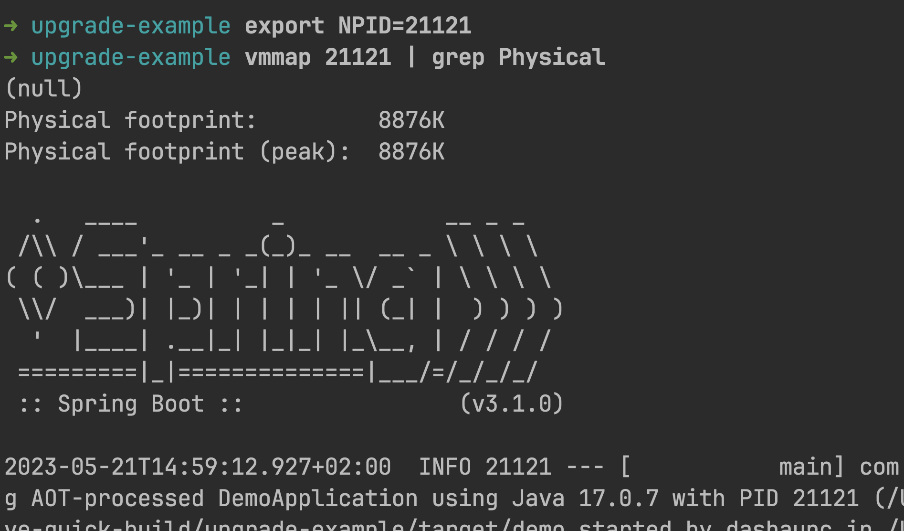
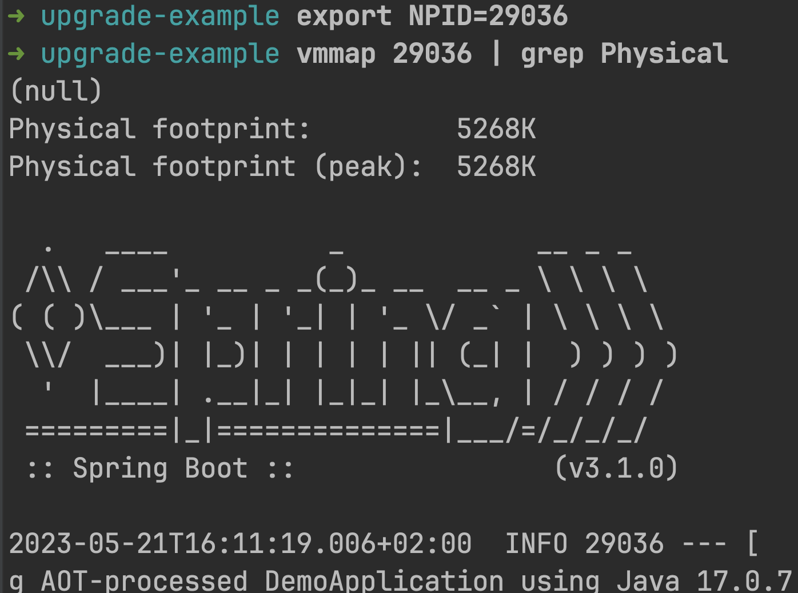

[![Forks][forks-shield]][forks-url]
[![Stargazers][stars-shield]][stars-url]
[![Issues][issues-shield]][issues-url]

# Spring Boot 3.1.0 GRAALVM_QUICK_BUILD

## Spring Boot 3.1.0 is amazing

I learned about GRAALVM_QUICK_BUILD at [Spring IO 2023](https://2023.springio.net/) which was also when Spring Boot 3.1.0 went GA.

The simple AOT demo that I have been running since November looks even better.

I'm also running the latest version of GraalVM, 22.3.2.

- JVM memory footprint is much better.
- GRAALVM_QUICK_BUILD saves time on this example
- The native images are even smaller than before, 9MB! for a Spring Boot 3.1.0 application!

### I couldn't believe it, so I shut everything else down and ran it again.

>6MB?!?!

<!-- MARKDOWN LINKS & IMAGES -->
<!-- https://www.markdownguide.org/basic-syntax/#reference-style-links -->
[forks-shield]: https://img.shields.io/github/forks/dashaun/spring-boot-3-1-native-quick-build.svg?style=for-the-badge
[forks-url]: https://github.com/dashaun/spring-boot-3-1-native-quick-build/forks
[stars-shield]: https://img.shields.io/github/stars/dashaun/spring-boot-3-1-native-quick-build.svg?style=for-the-badge
[stars-url]: https://github.com/dashaun/spring-boot-3-1-native-quick-build/stargazers
[issues-shield]: https://img.shields.io/github/issues/dashaun/spring-boot-3-1-native-quick-build.svg?style=for-the-badge
[issues-url]: https://github.com/dashaun/spring-boot-3-1-native-quick-build/issues